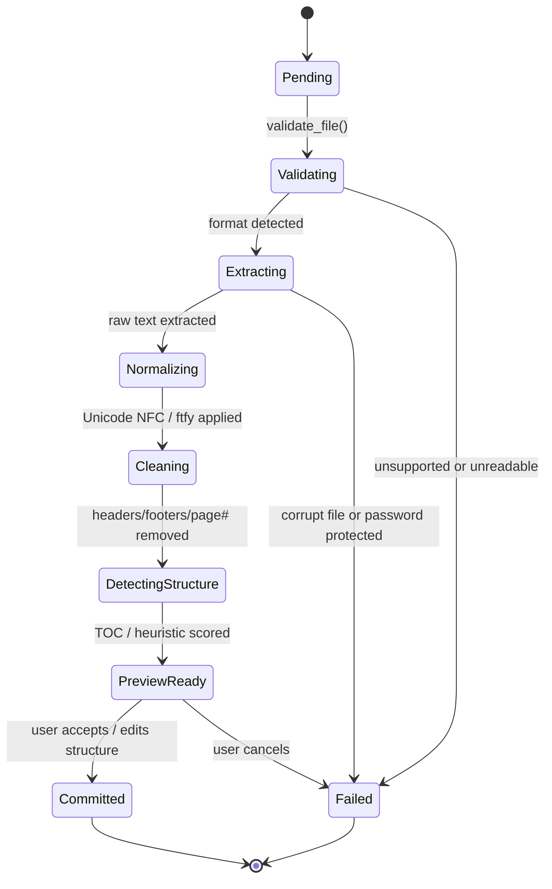
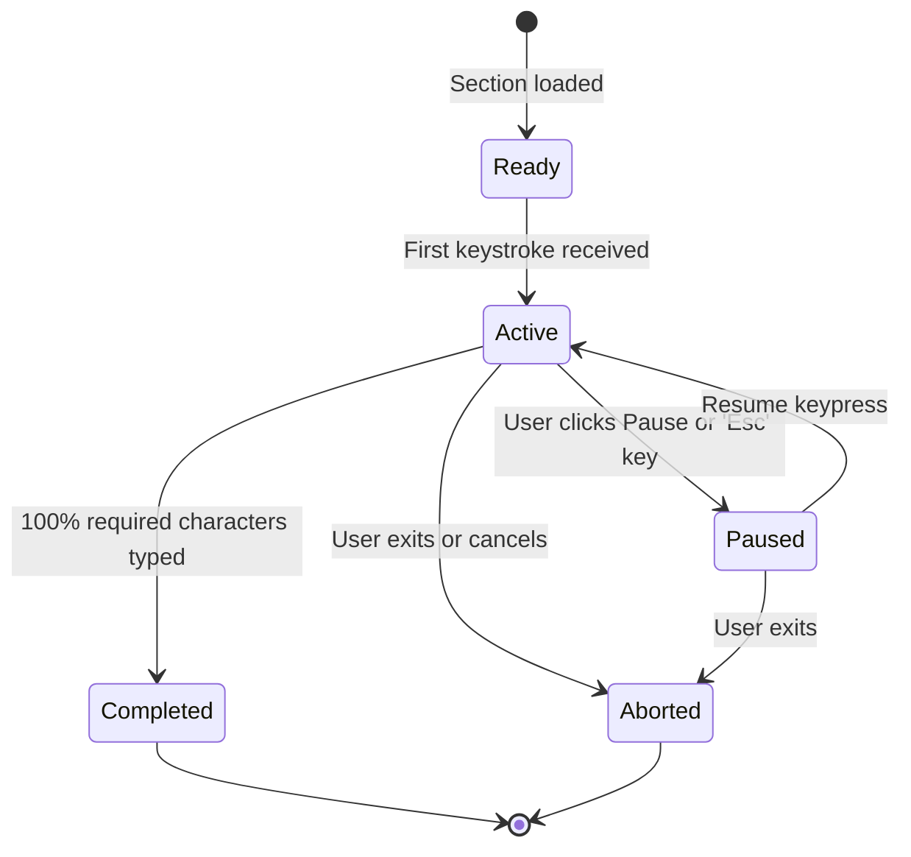

# TypeRead Architectural Decisions & System Blueprint
**Specification Version:** 1.0.0  
**Phase:** Gate 1 - System Architecture  
**Primary Author:** System Architect Agent  

---

## 1. Executive Summary & Foundational Principles

TypeRead is an offline-first desktop application engineered in Python 3.11+ and PySide6 (Qt) that transforms arbitrary user reading material into an interactive typing and retention environment.

### 1.1 Non-Negotiable Invariants
1. **Zero External AI / Zero Cloud Dependencies:** The Phase 1 MVP is 100% functional without an internet connection, cloud server, or external API key. All cleanup, structure detection, and practice drill generation are deterministic.
2. **Preservation of Source Material:** The original user document is never overwritten or mutated. Multiple representations (`source_text`, `normalized_text`, `display_text`, `typing_text`) are maintained with explicit bi-directional character offset maps.
3. **Sub-50ms Keystroke Latency:** Keypress capture and visual state updates must occur synchronously on the UI thread in $<50\text{ ms}$, with zero disk I/O on the keystroke hot path.
4. **Crash-Resilient State & Perfect Resume:** Exact typing coordinates (`document_id`, `chapter_id`, `section_id`, `paragraph_id`, `character_offset`) are debounced and committed atomically to SQLite. On unexpected termination, the application recovers the exact session state.
5. **Anti-Slop Strict Typing:** All domain types, IPC contracts, and database columns are strictly typed. Vague dictionaries, stringly-typed payloads, and untyped blobs are banned.

---

## 2. System Architecture & Module Boundaries

The application is structured into four decoupled layers following Clean Architecture principles:

```
┌────────────────────────────────────────────────────────────────────────┐
│                        PRESENTATION LAYER (UI)                         │
│  PySide6 Shell │ DocumentReaderWidget │ TypingEngineWidget │ NavTree  │
│                   ThemeManager │ AnalyticsViews                        │
└───────────────────────────────────┬────────────────────────────────────┘
                                    │ Qt Signals & Slots / Typed Events
┌───────────────────────────────────▼────────────────────────────────────┐
│                       SERVICE & APPLICATION LAYER                      │
│   DocumentService  │  TypingSessionService  │  AnalyticsService        │
│   SearchService    │  BackupService         │  SettingsService         │
│   (Implements exact operations defined in api.json / OpenAPI spec)     │
└───────────────────────────────────┬────────────────────────────────────┘
                                    │ Strict Dataclasses (types.py)
┌───────────────────────────────────▼────────────────────────────────────┐
│                          CORE DOMAIN ENGINES                           │
│  ┌───────────────────────┐ ┌──────────────────────┐ ┌────────────────┐ │
│  │   Document Engine     │ │    Typing Engine     │ │ Practice Engine│ │
│  │ - Importers (PDF,etc) │ │ - Keystroke Evaluator│ │ - Weak-Key     │ │
│  │ - Text Normalizer     │ │ - Metrics Calculator │ │   Aggregator   │ │
│  │ - Structure Heuristic │ │ - State Machine      │ │ - Corpus Drill │ │
│  └───────────────────────┘ └──────────────────────┘ └────────────────┘ │
└───────────────────────────────────┬────────────────────────────────────┘
                                    │ Repository Contracts
┌───────────────────────────────────▼────────────────────────────────────┐
│                    PERSISTENCE & INFRASTRUCTURE LAYER                  │
│  SQLite (WAL Mode) │ SQLite FTS5 Full-Text │ Local File System Store   │
│  Zip Backup Engine │ Schema Migrator       │ Local OCR (Tesseract)     │
└────────────────────────────────────────────────────────────────────────┘
```

### 2.1 Layer Responsibilities & Constraints
- **Presentation Layer (`src/ui/`):** Owns Qt widgets, rendering, stylesheets, and keyboard shortcut event filters. Must not perform direct SQL queries or file parsing.
- **Service Layer (`src/services/`):** Coordinates business transactions, wraps SQLite connections, dispatches background tasks, and emits typed events matching `api.json`.
- **Domain Engines (`src/core/`):** Pure Python modules without Qt or database dependencies. Can be tested 100% in isolation using standard unit tests.
- **Persistence Layer (`src/storage/`):** Encapsulates SQLite connection lifecycle, transaction boundaries, prepared statements, and directory file management.

---

## 3. Concurrency & Threading Architecture

To achieve rock-solid responsiveness on desktop machines:

```
┌──────────────────────────────────────────────────────────────┐
│                    MAIN THREAD (Qt Event Loop)               │
│ - UI Rendering                                               │
│ - Keystroke Capture (keyPressEvent) -> Evaluated in-memory   │
│ - Live Metrics Render (WPM, Accuracy, Progress Bar)          │
│ - Audio Feedback (QSoundEffect)                              │
└──────────────────────────────┬───────────────────────────────┘
                               │
                               │ QThreadPool / QRunnable
                               ▼
┌──────────────────────────────────────────────────────────────┐
│                  BACKGROUND WORKER THREADS                   │
│ - Document Parsing (PyMuPDF, python-docx, EbookLib)          │
│ - Local OCR (Tesseract subprocess / OCRmyPDF)                │
│ - SQLite FTS5 Heavy Indexing                                 │
│ - Autosave Periodic Commits (Worker / Debounced Worker)       │
│ - Backup Compression & Export (ZIP creation)                 │
└──────────────────────────────────────────────────────────────┘
```

### 3.1 Keystroke Hot Path Invariant
When a user presses a key in `TypingEngineWidget`:
1. The character is compared against `expected_char` in memory immediately ($\mathcal{O}(1)$ string lookup).
2. The UI cursor and text highlighting update in the same frame.
3. Keystroke telemetry (`KeystrokeInput`) is pushed into an in-memory ring buffer.
4. An in-memory autosave timer triggers every 10 seconds (or upon user pause) to flush accumulated metrics and current position to SQLite in a single transaction.
5. Disk I/O **never** blocks the keyboard event handler.

---

## 4. State Machines & Lifecycles

### 4.1 Document Ingestion Pipeline State Machine



#### Deterministic Structure Detection Heuristics:
Candidate heading score is calculated deterministically:
$$\text{Score} = w_1 S_{\text{font}} + w_2 S_{\text{bold}} + w_3 S_{\text{numbering}} + w_4 S_{\text{position}} + w_5 S_{\text{whitespace}} + w_6 S_{\text{shortline}} - w_7 P_{\text{length}}$$
Where:
- $S_{\text{font}}$: Font size relative to median body font size of page.
- $S_{\text{bold}}$: Font weight flag.
- $S_{\text{numbering}}$: Matches regex `^(Chapter|\d+\.|\d+\.\d+|Part|[IVXLCDM]+\.)`.
- $S_{\text{position}}$: Centered alignment or top-of-page offset.
- $P_{\text{length}}$: Penalty applied if string exceeds 120 characters or contains multiple sentence-ending periods.
- Score threshold $\ge 0.65$ classifies node as heading. Low-confidence headings ($0.65 \le \text{Score} < 0.80$) are explicitly flagged in preview for user confirmation.

### 4.2 Typing Session State Machine



### 4.3 Crash Recovery & Persistence State Machine
1. Every 10 seconds during `Active` state, the background worker executes:
   ```sql
   UPDATE reading_progress 
   SET paragraph_id = :p_id, character_offset = :offset, updated_at = :now 
   WHERE user_id = :u_id AND document_id = :d_id;
   ```
2. When the application starts up:
   - Queries `typing_sessions` for any session where `state IN ('active', 'paused')` and `completed = 0`.
   - If found, displays a modal dialog: **"Unfinished practice session found for [Document Title], Chapter [N] ([Progress]%). Resume practice?"**
   - If user confirms: jumps directly to the saved position.
   - If user declines: marks session `aborted`.

---

## 5. Text Representations & Character Offset Mapping

Documents contain formatting, punctuation, and line breaks that may be transformed depending on user-selected typing modes (`Standard`, `Lowercase`, `No Punctuation`, etc.).

### 5.1 The 4 Representations
1. `source_text`: Exact raw text extracted from PDF/EPUB/DOCX.
2. `normalized_text`: Cleaned text with Unicode normalization, repaired hyphenation, stripped headers/footers, and merged soft-wrapped lines.
3. `display_text`: The human-readable formatted paragraph rendered in the upper source reader panel.
4. `typing_text`: The exact character stream the user is expected to type in the input panel (filtered by `TypingMode`).

### 5.2 Bi-Directional Offset Map Invariant
To ensure that typing character $i$ in `typing_text` highlights the exact corresponding word or character in `display_text`:
- `typing_to_display_indices`: An array of length $N = \text{len}(\text{typing\_text})$ where element $i$ contains the integer index $j$ into `display_text`.
- Example: If `display_text` is `"The 'Habit Loop'"` and `typing_text` (mode `no_punctuation`) is `"The Habit Loop"`, the quote characters are skipped, and each letter maps directly to its position in `display_text`.

---

## 6. Typing Metrics Mathematical Standards

Metrics must be mathematically sound, verifiable, and free from floating-point distortion.

### 6.1 Words Per Minute (WPM)
Standard typographical convention defines $1 \text{ word} \equiv 5 \text{ keystrokes}$ (including spaces):

$$\text{Gross WPM} = \frac{\text{Total Characters Typed} / 5}{\text{Active Seconds} / 60}$$

$$\text{Net WPM} = \max\left(0.0, \; \frac{\text{Correct Characters Typed} / 5}{\text{Active Seconds} / 60}\right)$$

### 6.2 Accuracy
$$\text{Accuracy (\%)} = \left(\frac{\text{Correct Keystrokes}}{\text{Total Keystrokes}}\right) \times 100$$
Where:
- $\text{Total Keystrokes} = \text{Correct Keystrokes} + \text{Incorrect Keystrokes}$. Backspace keys are tracked separately and not counted as double errors.

### 6.3 Consistency
Consistency measures rhythm uniformity. The session is broken into 1-second interval WPM samples $w_1, w_2, \dots, w_k$:
$$\mu = \frac{1}{k}\sum_{i=1}^k w_i, \quad \sigma = \sqrt{\frac{1}{k}\sum_{i=1}^k (w_i - \mu)^2}$$
$$\text{Consistency (\%)} = \max\left(0.0, \; 100.0 \times \left(1.0 - \frac{\sigma}{\mu + \epsilon}\right)\right)$$

### 6.4 Weak-Key & Bigram Aggregations
For every incorrect keystroke:
1. `(expected_char, actual_char)` recorded in `typing_errors`.
2. `weak_key_aggregates` updated for `expected_char`.
3. If previous character was $c_{prev}$, bigram $c_{prev} + \text{expected\_char}$ updated in `weak_bigram_aggregates`.
4. Weak-key drill generator queries top 5 weakest keys and generates practice paragraphs by filtering words from the user's document vocabulary containing those characters.

---

## 7. Storage, Filesystem & Backup Architecture

### 7.1 Local Filesystem Layout
The application root is located in the user's local app data directory:
- **Windows:** `%LOCALAPPDATA%\TypeRead\`
- **Linux:** `~/.local/share/TypeRead/`
- **macOS:** `~/Library/Application Support/TypeRead/`

Directory Tree:
```text
TypeRead/
├── database/
│   ├── library.db               # SQLite database file
│   ├── library.db-wal           # Write-Ahead Log
│   └── library.db-shm           # Shared memory index
├── documents/
│   └── <document-uuid>/
│       ├── source/
│       │   └── original.<ext>   # Original imported document (immutable)
│       ├── processed/
│       │   ├── structure.json   # Cached document structural tree
│       │   └── text_cache.bin   # Fast memory-mapped text cache
│       └── assets/
│           └── cover.jpg        # Extracted book cover thumbnail
├── backups/
│   └── typeread_backup_*.zip    # Exported backups
└── logs/
    └── typeread.log             # Rotating log file
```

### 7.2 Backup & Export Standard
The export format `.typeread-backup` is a standard ZIP archive containing:
1. `manifest.json`: Includes `backupVersion: 1`, `appVersion`, timestamp, and SHA-256 checksums of all bundled files.
2. `library.db`: Clean SQLite snapshot generated using the SQLite Online Backup API (`sqlite3_backup`).
3. `documents/`: Preserves all original source files and covers.
4. Verification: On import, the destination system validates the SHA-256 checksums in `manifest.json` before performing database migrations or file writes.

---

## 8. Verification Checklist for Downstream Roles

### 8.1 Gate 2: Backend Implementation Checklist
- [ ] **Document Importers:** Implement parsers for PDF (`fitz`), EPUB (`ebooklib`), DOCX (`docx`), TXT, Markdown, and HTML adhering to `DocumentFormat`.
- [ ] **Cleaning Pipeline:** Implement regex header/footer detection across page boundaries, hyphenation repair (`foo-\nbar` -> `foobar`), and Unicode NFC normalization with `ftfy`.
- [ ] **Deterministic Scorer:** Implement `StructuralNodeConfidence` scoring without AI dependencies.
- [ ] **SQLite Repository:** Execute `schema.sql`, configure WAL mode, and verify all queries use prepared statements with strict parameter binding.
- [ ] **FTS5 Integration:** Verify triggers synchronize paragraph changes into `document_fts`.
- [ ] **Typing Engine Core:** Implement in-memory keystroke evaluation, gross/net WPM, accuracy, consistency, and weak-key updates.
- [ ] **Backup Service:** Implement ZIP archive generation with `manifest.json` and SHA-256 validation.

### 8.2 Gate 3: Frontend (PySide6) Implementation Checklist
- [ ] **Sub-50ms Input Widget:** Implement `TypingEngineWidget` overriding `keyPressEvent` with zero disk access on keypress.
- [ ] **Dual Reader Display:** Upper widget renders `display_text`; lower widget renders typing input with caret animations.
- [ ] **Navigation Sidebar:** Implement `QTreeView` binding to `DocumentStructureTree` with chapter/section hierarchy and progress badges.
- [ ] **Theme System:** Provide `Light`, `Dark`, `Sepia`, `Paper`, `High Contrast`, and `Midnight` QSS stylesheets matching `ThemeId`.
- [ ] **Focus & Zen Modes:** Support `Ctrl+Shift+F` (hides sidebars/headers) and `Ctrl+Shift+Z` (fullscreen minimal reader).
- [ ] **Crash Recovery Prompt:** Display startup prompt when unclosed session is detected.
- [ ] **Import Preview Dialog:** Render before/after cleaning diffs and chapter hierarchy review tree.

### 8.3 Gate 4: QA & Verification Checklist
- [ ] **Offline Execution Test:** Disconnect all network interfaces (`ip link set eth0 down` or equivalent) and verify full app lifecycle.
- [ ] **Zero API Key Test:** Verify application starts without any AI keys or remote service configuration.
- [ ] **Corpus Regression Test:** Execute batch import over test corpus (scanned PDF, TOC-less PDF, multi-column PDF, EPUB, DOCX) and verify zero unhandled exceptions.
- [ ] **Keystroke Latency Benchmark:** Benchmark typing loop under 100 Hz simulated keystroke flood and verify latency remains $<50\text{ ms}$.
- [ ] **Autosave & Resume Test:** Kill application process mid-session (`SIGKILL`) and verify resumption at exact character offset on reboot.
- [ ] **Backup Integrity Test:** Export backup, corrupt 1 byte of the SQLite database in the zip, and verify `validateBackup` rejects it with `BACKUP_CORRUPTED`.
